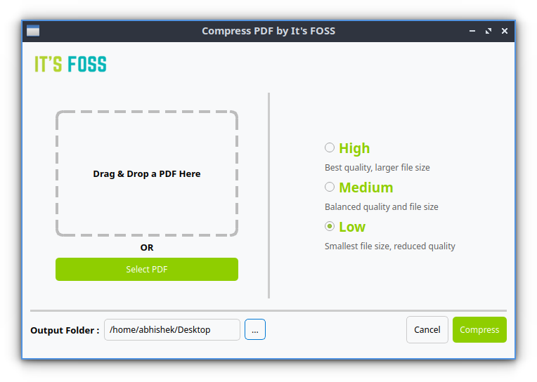

# Compress PDF v1.0

**Compress PDF** is a simple and efficient tool designed to reduce the size of PDF files without compromising quality. This version features a sleek and modern UI built using **Qt6**, making the compression process more user-friendly.  



## About  
This project is built with **Python** and **PyQt6**, utilizing **Ghostscript** for PDF compression. Since I am still learning how to package Python scripts into executable binaries, I welcome any contributions, feedback, or guidance from the community to improve this tool.  

## Installation  

### 🔹 Required Dependencies  
Before installing, ensure you have the following dependencies installed:  

```bash
sudo apt update && sudo apt install -y python3 python3-venv python3-pip ghostscript -y
```

### 🔹 Installing the `.deb` Package  
Once dependencies are installed, you can install the `.deb` package using:  

```bash
sudo dpkg -i pdf-compress-v1.0.deb
```

If you encounter dependency errors, fix them with:  

```bash
sudo apt --fix-broken install
```

## Running the AppImage  
An **AppImage** version is also available for easier execution.  

### 🔹 Make it Executable  
```bash
chmod +x pdf-compress-v1.0.AppImage
```

### 🔹 Run the AppImage  
```bash
./pdf-compress-v1.0.AppImage
```
