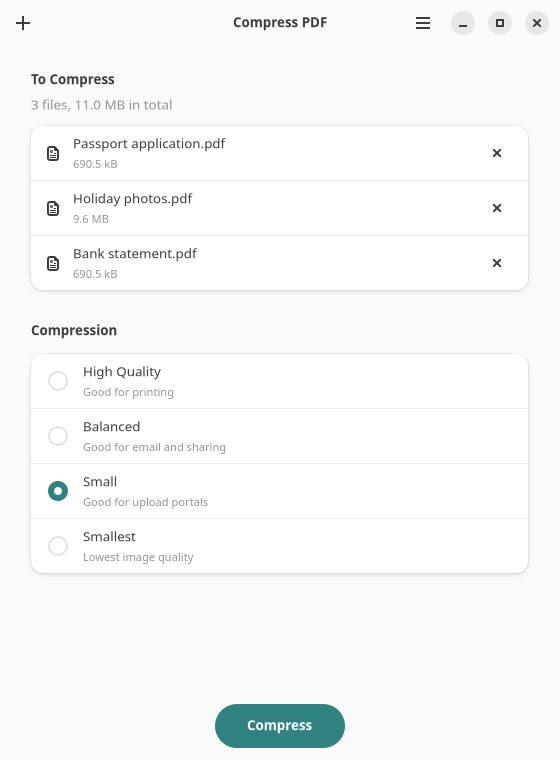
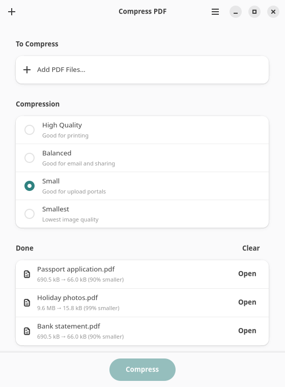

# Compress PDF

Compress PDF is a small Linux desktop app that makes PDF files smaller. You drop in your files, pick how small you need them, and choose where to save. That's it.



## Why I made this

I built the first version of this app for a very ordinary problem. Job portals, government websites and university forms often refuse PDFs above 1 or 2 MB, and a scanned document from your phone or office scanner can easily be 10 MB. Ghostscript can shrink those files, but not everyone wants to remember a long terminal command.

The old version did its job for a while, then started crashing on newer distributions like Linux Mint 22 and Ubuntu 24.04. So I rewrote it from scratch for version 3. It now uses GTK 4 and libadwaita, which means it looks at home on GNOME and works fine on KDE Plasma and other desktops too.

## What it does

You can add one file or several at once, by clicking Select Files, by dragging them onto the window, or by right-clicking a PDF in your file manager and choosing Open With. Each file shows its own progress, page by page, and you can cancel at any time.

When a file is done, you see its old and new size and how much smaller it got. Finished files move to a separate Done list with an Open button, so they don't get compressed again by accident.

I've also made sure the app never makes things worse. If compressing doesn't save at least 5%, the app tells you the file is already optimised and doesn't save anything. It never overwrites your original, and if a file with the same name already exists, it saves a numbered copy instead.

Everything happens on your computer. Your files are not uploaded anywhere.



## Which compression level should you pick?

There are four levels. Each one lowers the resolution of the images inside the PDF and how finely they're stored. Text and vector graphics are kept as they are.

| Level | Good for | Image resolution |
|---|---|---|
| High Quality | Printing | 200 dpi |
| Balanced | Email and sharing | 150 dpi |
| Small | Upload portals with size limits | 100 dpi |
| Smallest | When nothing else fits | 72 dpi |

If you're not sure, start with Balanced. If the file is still too big for the website you're uploading to, try Small. In my tests with scanned documents, Balanced made files about 50% to 90% smaller, and Small kept even 7 pt fine print readable.

## Installing Compress PDF

Download the latest files from the [releases page](https://github.com/itsfoss/compress-pdf/releases/latest).

### Ubuntu, Linux Mint, Debian and similar

Get the `compress-pdf_3.0.0_all.deb` file and install it with:

```bash
sudo apt install ./compress-pdf_3.0.0_all.deb
```

The package is under 20 KB because it uses the GTK, libadwaita and Ghostscript that your distribution already provides. You need Ubuntu 24.04, Linux Mint 22, Debian 13 or newer. Older versions don't have a recent enough libadwaita, so use the Flatpak there instead.

### Any distribution with Flatpak

Get the `compress-pdf-3.0.0.flatpak` file and install it with:

```bash
flatpak install --user ./compress-pdf-3.0.0.flatpak
```

This version comes with its own copy of Ghostscript, so you don't need to install anything else. It's about 12 MB. If you don't have the GNOME runtime yet, Flatpak downloads it from Flathub the first time.

The Flatpak runs in a sandbox with no access to your files or the internet. It only sees the files you pick or drop in, and it only saves where you tell it to.

### Building from source

You need Meson, blueprint-compiler, PyGObject, GTK 4, libadwaita 1.5 or newer and Ghostscript. Then run:

```bash
meson setup build --prefix=$HOME/.local
meson install -C build
compress-pdf
```

To run the tests, install pytest and use `meson test -C build`.

## Known limitations

Password-protected PDFs aren't supported yet. The app tells you when a file is protected, and I plan to add a password prompt in a later version.

Some PDFs made from phone photos place very large images on oversized pages. The dpi limits can't do much with those, so they shrink less than you might expect. I'm looking at an option to fit such pages to A4 or Letter size, which made one of my test files four times smaller.

## Reporting problems

If something doesn't work, please [open an issue](https://github.com/itsfoss/compress-pdf/issues). Tell me your distribution, your desktop, and whether you used the .deb, the Flatpak or the source. Running `compress-pdf` (or `flatpak run com.itsfoss.CompressPDF`) from a terminal shows error messages that help a lot.

Please don't attach private documents. If you need a file to show the problem, try to find a public PDF that does the same thing.

If you want to help test a new version, the [test checklist](docs/TESTING.md) walks you through everything worth checking.

## License

Compress PDF is free software under the [GNU General Public License v3.0 or later](LICENSE). The app icon and screenshots are under [CC BY-SA 4.0](https://creativecommons.org/licenses/by-sa/4.0/).

It uses [Ghostscript](https://www.ghostscript.com/) by Artifex Software, which is licensed under the GNU AGPL v3.

Made by [It's FOSS](https://itsfoss.com/).
